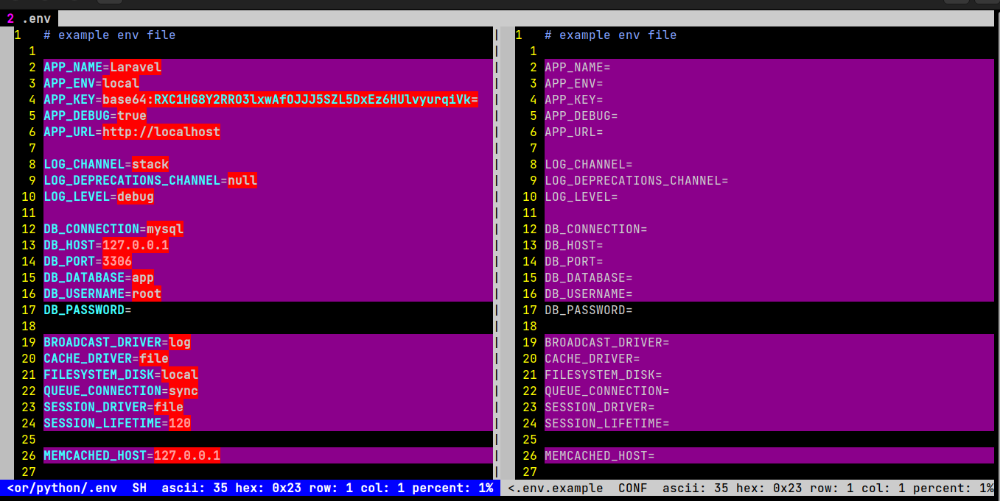

# Introduction

 Generates a .env.example file which equivalent to given template but without values/secrets.

 

# Note
> If no args are provided default will be `.env`.

> This will **replace** .env.example if exists.

 # Usage
 1. Python
 ```sh
# *** method 1 ***
chmod a+x python/example-env.sh 
./python/example-env.sh [.env template]

# *** method 2 ***
python python/app.py [.env template]

```